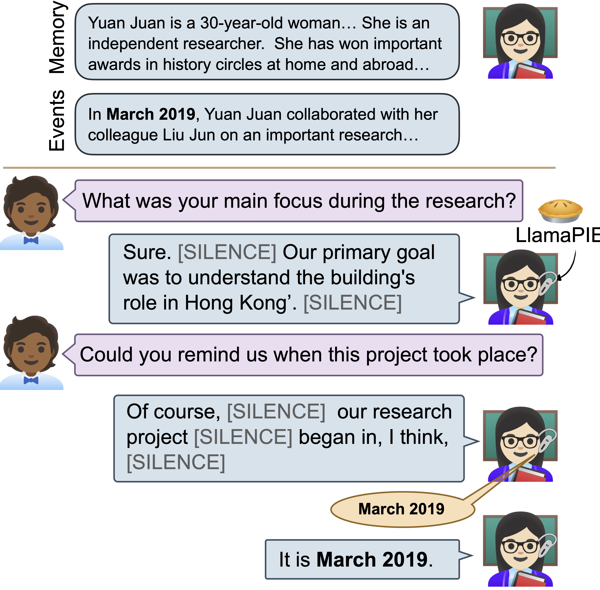

# 🥧 LlamaPIE
## LlamaPIE🥧: Proactive In-Ear  Conversation  Assistants

<p align="center">
        🤗 <a href="https://huggingface.co/tuochao/Llama-3.1-8B-Proactive-Big-Peft">Hugging Face</a>&nbsp&nbsp | &nbsp&nbsp 📑 <a href="https://arxiv.org/abs/xxx">Paper</a> &nbsp&nbsp ｜ &nbsp&nbsp🖥️ <a href="https://huggingface.co/tuochao/Llama-3.1-8B-Proactive-Gen-Positive-mlx-8bit">MLX Model</a>
</p>

<p align="center">
    
<p>

LlamaPIE🥧 is a **Proactive**, **In-Ear** assistant that augments human-to-human communication by providing discreet guidance via hearable devices. Its responses are short, provided only when helpful, and leverage the wearer's memory of past events. In the figure, LlamaPIE assists Yuan by whispering 1-3 words to her during the conversation only when needed by anticipating user needs, remaining silent most of the time.

## 💡 Highlight
* In-ear AI system could **proactively** assist users' vocal conversation without explicit invocation
* Proactively determining when to provide assistance and delivering concise, unobtrusive messages, e.g. reminding, guidance, and support.
* Streaming and realtime operation in MLX framework in Apple Silicon

## 📑 Open-source Plan

- [x] Inference code and checkpoints
- [x] Training code
- [ ] Realtime on-device speech and text pipeline


# 🔧Quick Start
## Setup environment
```
git clone https://github.com/chentuochao/LlamaPIE.git
conda create -n llamapie python=3.9
pip install -r requirement.txt
```
## Dataset preparation
Training/Val dataset and Test dataset

# 📊 Inference

Torch version LlamaPIE🥧 checkpoint available in Huggingface <a href="https://huggingface.co/tuochao/Llama-3.1-8B-Proactive-Big-Peft">Large Model</a> and <a href="https://huggingface.co/tuochao/Llama-3.2-1B-Proactive-Small-Peft">Small Model</a>. Also we release the MLX version of LlamaPIE🥧 for on-device real-time application: <a href="https://huggingface.co/tuochao/Llama-3.1-8B-Proactive-Gen-Positive-mlx-8bit">Large Model</a> with INT8 quantization and <a href="tuochao/Llama-3.2-1B-Proactive-Classifier-Aug-mlx-fp16">Small Model </a> with FP16 quantization.

## Run inference on single conversation sample
To run our Ll on a single conversation sample, create a folder <INPUT_FOLDER> and prepare two text files:

(1) dialogue.txt: store the dialogue. In the dialogue, Here is a example of dialogue. Each turn start with "User: " or "Speaker*: ". We also have a special token " |SILENCE >" to represent the 0.5s second silence in the spoken dialogue.
<details>
<summary>One dialogue example</summary>
```
Speaker1:  So, how are you doing? User: I'm pretty good. |SILENCE > |SILENCE > Doing well. |SILENCE > |SILENCE > |SILENCE > Speaker1: So, please tell me about yourself. |SILENCE > |SILENCE > Okay. |SILENCE > |SILENCE > |SILENCE > User: So, I guess... Have you looked at my resume, or should I? Alright. So, I guess I'm a course 6-7 here at MIT, which is computational biology. So, it's a mix of computer science and biology. And actually, that's where my interests lie, in applying, like, algorithmic kind of software engineering to data sets, dealing with genomics and biology. |SILENCE > |SILENCE > Some of the activities to do outside of school include Camp Kesem, which is a summer camp that we run for completely free for kids whose parents have cancer, as well as Amphibious Achievement, which is a high school tutoring program for inner-city kids in Boston. |SILENCE > |SILENCE > |SILENCE > So, |SILENCE > |SILENCE > my interests kind of lie both in a little bit of the healthcare. I imagined I was going to be a doctor growing up, and then I came to MIT, and I'm like, well, I can do engineering and still apply a lot of these same things and help a lot more people. |SILENCE > |SILENCE > |SILENCE > |SILENCE > Speaker1: So, please tell me about a time you demonstrated leadership. |SILENCE > |SILENCE > Okay. |SILENCE > |SILENCE > User: One of the things that we have to do for Camp Kesem is fundraise all the money to |SILENCE > |SILENCE > run the camp, which is over $50,000. |SILENCE > |SILENCE > And so, one of the things that I individually spearhead every year is called the Camp Kesem SAE Data Auction, where actually my fraternity and I go out and solicit |SILENCE > |SILENCE > |SILENCE > donations in the form of gift cards to raise money for a data auction where we actually sell dates. And then we use this money, obviously, and we donate it to Camp Kesem. So, I spearhead the entire event, and I kind of organize it into committees and groups, and I send the people out and make sure everything |SILENCE > |SILENCE > goes according to plan. |SILENCE > |SILENCE > Speaker1: Tell me about a time when you were working on a team and faced with a challenge. How did you solve that problem? |SILENCE > |SILENCE > |SILENCE > |SILENCE > |SILENCE > |SILENCE > |SILENCE > |SILENCE > |SILENCE > User: I guess the easiest team project I just had was |SILENCE > |SILENCE > last semester, I worked on a 6.005 project, which is software architecture. |SILENCE > |SILENCE > And we were put in a group of three people, and it was the standard, you know, we signed the contract, everyone's supposed to work equally, but it ended up being by the end of it that someone didn't put their fair share of work in. |SILENCE > |SILENCE > |SILENCE > Essentially, we talked to them, we didn't really get it out, and we actually had to go to some of the TAs. We got a little bit... |SILENCE > |SILENCE > And that kind of pushed them forward. So, I mean, I guess what I'm showing is I'm not afraid to go to the right methods. Authority weren't cases where the situation presents itself. Speaker1: Oh, yes. |SILENCE > |SILENCE > |SILENCE > |SILENCE > |SILENCE > |SILENCE > Tell me about one of your weaknesses, and how you plan to overcome it. |SILENCE > |SILENCE > |SILENCE > |SILENCE > |SILENCE > User: Um... |SILENCE > |SILENCE > |SILENCE > I would say, for this job, I'm a little bit technically underprepared. |SILENCE > |SILENCE > |SILENCE > I've only taken the introductory software classes so far, as well as introductory bio classes. |SILENCE > |SILENCE > But I think, just from sheer interest and sheer effort, I'll be able to overcome these obstacles. |SILENCE > |SILENCE > |SILENCE > |SILENCE > |SILENCE > Speaker1: Now, why do you think we should hire you? |SILENCE > |SILENCE > |SILENCE > User: I'm very interested in the subject of computational biology, and I think that I'll be able to contribute a lot to this field. I've had a good amount of experience, and I think I'll be a solid intern. |SILENCE > |SILENCE > |SILENCE > |SILENCE > |SILENCE > Speaker1: Well, thank you.
```

</details>

(2) mem.txt(Optional): store the user's memory

Then run the following script and the pro-active assistance will be provided. The dialogue will be streamed into the small and large model token by token.
```
python infer_dual_model.py --input-path <INPUT_FOLDER> --save-path <SAVE_FOLDER>
```


## Run inference on dataset
In our evaluation, the <DATASET_NAME> have 4 options: 
* Sync_claude: synthetic conversation generated from Claude,  
* Sync_perl: synthetic conversation from [PerLTQA](https://github.com/Elvin-Yiming-Du/PerLTQA) dataset, 
* Sync_soda: synthetic conversation from [SODA](https://huggingface.co/datasets/allenai/soda)
* MIT: real-recorded conversation from [MIT](https://roc-hci.com/past-projects/automated-prediction-of-job-interview-performances/) interview dataset
```
python infer_dual_model.py --dataset <DATASET_NAME> --save-path <SAVE_FOLDER>
```
## Rubric Score evaluation
We use ChatGPT-4o as our rubric score evaluator, the eval prompting and scripts is as follow:
```
python infer_dual_model.py
```

# 🏋️‍♂️ Training
## Train the small model
```
python train_small.py --save_path /gscratch/intelligentsystems/tuochao/Proactive_Agent/experiment/classifier_4data_whisper_aware
```

## Train the large model
```
python train_large.py --model llama3_1-8b --data_path /scr/Final_Generation/Pos_Neg/ --save_path /gscratch/intelligentsystems/tuochao/Proactive_Agent/experiment/generator_3data
```